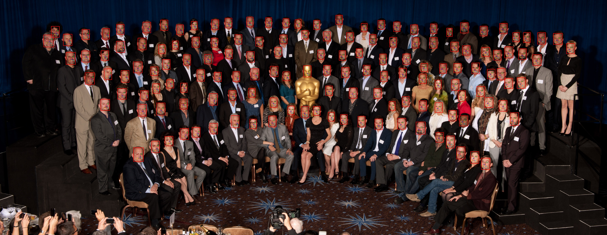
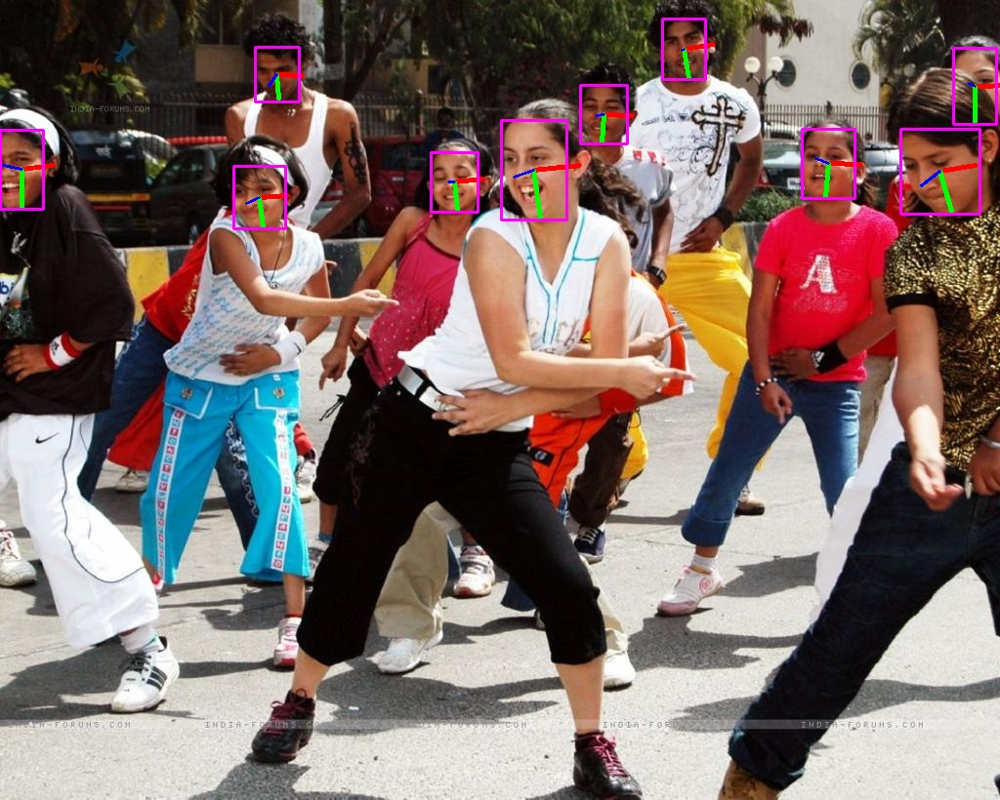

# RetinaFace_Pytorch
Reimplement RetinaFace with Pytorch

## Installation
##### Clone and install requirements
    $ git clone https://github.com/supernotman/RetinaFace_Pytorch.git
    $ cd RetinaFace_Pytorch/
    $ sudo pip install -r requirements.txt

Pytorch version 1.1.0+ and torchvision 0.3.0+ are needed.

##### Data
1. Download widerface dataset

2. Download annotations (face bounding boxes & five facial landmarks) from [baidu cloud](https://pan.baidu.com/s/1Laby0EctfuJGgGMgRRgykA) or [dropbox](https://www.dropbox.com/s/7j70r3eeepe4r2g/retinaface_gt_v1.1.zip?dl=0)

3. Organise the dataset directory as follows:

```Shell
  widerface/
    train/
      images/
      label.txt
    val/
      images/
      label.txt
    test/
      images/
      label.txt
```

## Train
```
$ train.py [-h] [data_path DATA_PATH] [--batch BATCH]
                [--epochs EPOCHS]
                [--shuffle SHUFFLE] [img_size IMG_SIZE]
                [--verbose VERBOSE] [--save_step SAVE_STEP]
                [--eval_step EVAL_STEP]
                [--save_path SAVE_PATH]
                [--depth DEPTH]
```

#### Example
For multi-gpus training, run:
```
$ CUDA_VISIBLE_DEVICES=0,1,2,3,4,5 python train.py --data_path /widerface --batch 32 --save_path ./out
```

#### Training log
```
---- [Epoch 39/200, Batch 400/403] ----
+----------------+-----------------------+
| loss name      | value                 |
+----------------+-----------------------+
| total_loss     | 0.09969855844974518   |
| classification | 0.09288528561592102   |
| bbox           | 0.0034053439740091562 |
| landmarks      | 0.003407923271879554  |
+----------------+-----------------------+
-------- RetinaFace Pytorch --------
Evaluating epoch 39
Recall: 0.7432201780921814
Precision: 0.906913273261629
```

##### Pretrained model
You can download the model from [baidu cloud](https://pan.baidu.com/s/1jSxQ1kficgoychXX9b5crg) or [dropbox](https://www.dropbox.com/s/hvqveb6if724ise/model.pt?dl=0)

## Detect
##### Image
```
$ python detect.py --model_path model.pt --image_path 4.jpg
```

##### Video
```
$ python video_detect.py --model_path model.pt 
```

<p align="center"></p>

## Pose
Hey, I find something interesting and add it in the code.
Pose detection Hopenet: https://github.com/natanielruiz/deep-head-pose
Now you can estimate pose with RetinaFace and Hopenet.
Download [pose model](https://drive.google.com/file/d/1m25PrSE7g9D2q2XJVMR6IA7RaCvWSzCR/view)
```
$ python pose_detect.py --f_model model.pt --p_model hopenet.pkl --image_path test.jpg
```
also you can detect in video
```
$ python pose_detect.py --f_model model.pt --p_model hopenet.pkl --type video --video_path test.avi
```
<p align="center"></p>

## Todo: 
- [ ] Wider Face mAP calculation
- [ ] Deformable Convolution
- [ ] More models support
- [ ] Random crop and color distortion
- [ ] Graph Convolution
- [ ] Bug fix
